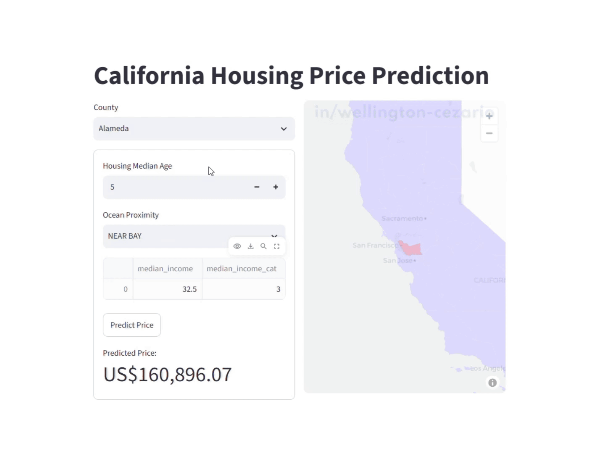

# California Housing Price Prediction

This project was developed as part of my Data Science studies with Hashtag Code School. During the process, I learned how to explore and prepare the California Housing dataset, create useful features, and visualize patterns in the data.

I also practiced building and comparing regression models, including Linear Regression and regularized models such as Ridge and Elastic Net. This project helped me understand the steps involved in a machine learning workflow and the importance of evaluating a model before using it.

As part of the project, I also developed a California Housing Price Predictor app with Streamlit. It has two views: a form where users enter housing information to get a price prediction, and a map showing the selected county. Building the app helped me apply what I learned in an interactive tool.

**Try the app:** [California Housing Price Predictor](https://californiahousingpriceprediction-wgt.streamlit.app/)

### App Preview




Inspiration: [Curso Data Science Prof Chico Lucio](https://www.hashtagtreinamentos.com/) 


## Organização do projeto

```
├── .env               <- Arquivo de variáveis de ambiente (não versionar)
├── .gitignore         <- Arquivos e diretórios a serem ignorados pelo Git
├── environment.yml       <- O arquivo de requisitos para reproduzir o ambiente de análise
├── LICENSE            <- Licença de código aberto se uma for escolhida
├── README.md          <- README principal para desenvolvedores que usam este projeto.
|
├── dados              <- Arquivos de dados para o projeto.
|
├── modelos            <- Modelos treinados e serializados, previsões de modelos ou resumos de modelos
|
├── notebooks          <- Cadernos Jupyter. A convenção de nomenclatura é um número (para ordenação),
│                         as iniciais do criador e uma descrição curta separada por `-`, por exemplo
│                         `01-fb-exploracao-inicial-de-dados`.
│
|   └──src             <- Código-fonte para uso neste projeto.
|      │
|      ├── __init__.py  <- Torna um módulo Python
|      ├── config.py    <- Configurações básicas do projeto
|      └── graficos.py  <- Scripts para criar visualizações exploratórias e orientadas a resultados
|
├── referencias        <- Dicionários de dados, manuais e todos os outros materiais explicativos.
|
├── relatorios         <- Análises geradas em HTML, PDF, LaTeX, etc.
│   └── imagens        <- Gráficos e figuras gerados para serem usados em relatórios
```
